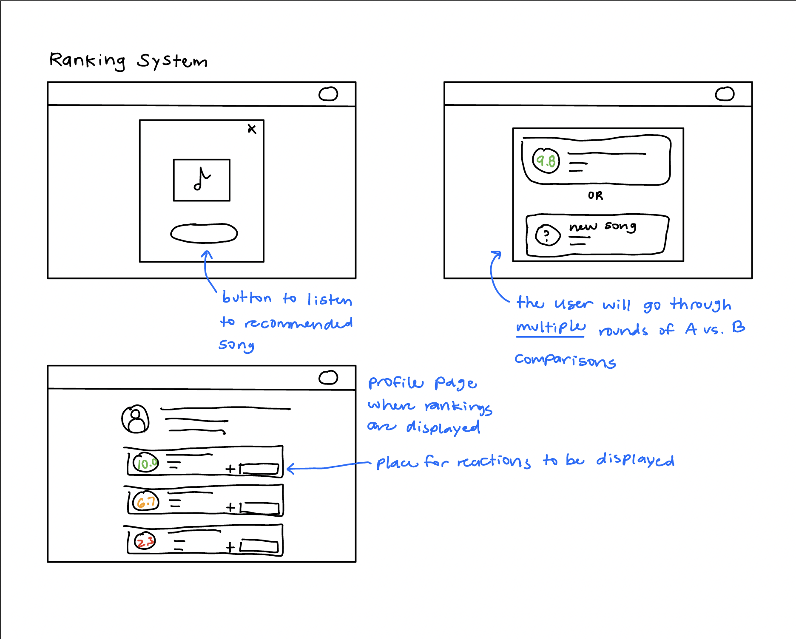
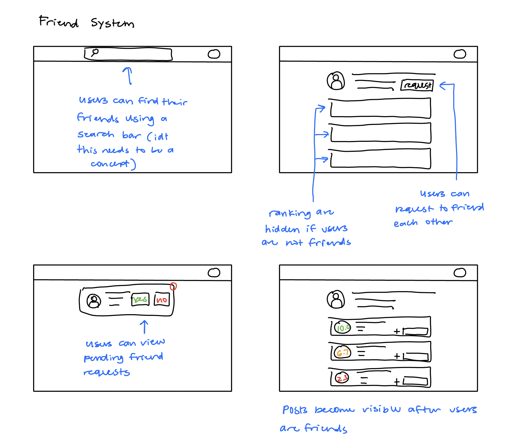

# Assignment 2
## Problem Statement
### Problem Domain
**Listening to music**: I enjoy listening to music, mostly through Spotify. I like discovering new songs but usually just use the Discover Weekly playlist, which makes my listening feel passive. I often come across songs I like, but I don’t have a good way to keep track of how they compare to others or how my preferences are shifting over time. I rarely make playlists anymore because it feels like too much work, and just add all songs to my Liked Songs playlist. I’d like a simple and fun way to interact with music daily, where I can rank songs as I go and compare my taste with friends, without needing to dive into heavy data or charts.
### Problem
**Ranking songs**: Almost every day I listen to new music, but I don’t have a good way to place songs I like in order of preference. Over time I forget how new songs stack up against old favorites. I want a simple way to rank songs as I hear them and compare my rankings with friends, instead of just listening then losing track of what I actually enjoy most.
### Stakeholder List
1. **Ranker** is the user who ranks songs and uses the app. Impact: discover new songs faster and can keep track of favorites
2. **Friend** is someone user compares rankings with. Impact: discover new songs faster and can keep track of favorites
3. **Group DJ** is someone who picks music for parties/car rides and wants consensus picks. Impact: Can play music in cars/events that everyone likes.
4. **Streaming platforms** want to know the engagement with different genres and artists on their platform so they know who to promote. Impact: more engagement with advertisements.
5. **Artists** gain more dedicated fans, as listeners refine their music tastes based on data. Impact: artists can grow their fanbase as well as view the location of their audiences to strategically plan concerts and tours.
### Evidence and Comparables
1. IUI ’19 (ACM) — “Prediction of Music Pairwise Preferences from Facial Expressions.” An HCI/recommender study arguing that pairwise comparisons are more reliable than absolute ratings—especially in music where context (mood, activity) shifts utility—because users find it easier to say “A vs. B” than assign stars.
2. [Spotify Wrapped Marketing Strategy: Data Storytelling & Creating a Viral Cultural Phenomenon](https://nogood.io/blog/spotify-wrapped-marketing-strategy/) describes what a success Spotify Wrapped (a music taste visualization tool) is. Over 227 million users interacted with this feature in 2023. This shows the market for lightweight and social features built around music preference.
3. [last.fm](https://www.last.fm/) is a comparable. It is notably inaccurate with data, which is it's main drawback.
4. [receiptify](https://www.receiptify.us/) is a comparable that displays most listened to songs, artist, etc. for the past month. However, it lacks robustness and flexibility in the data that is displayed.
5. [Obscurify](https://obscurify.us/) is a comparable that benchmarks your artist preferences against over 120 million other Spotify listeners, making it highly accurate in quantifying your music taste uniqueness.
## Application Pitch
### Name
Meli
### Motivation
Music listeners lack a simple, ongoing way to rank songs relative to each other and compare their rankings with friends, turning passive listening into an interactive, social experience.
### Key Features
1) **Daily Recommendation**: Each day, the app recommends a new song for the platform to listen to and consider ranking. This helps solve the problem of passive listening by creating a lightweight, structured way to engage with new music. For listeners, it builds a consistent habit. For artists, it provides exposure to fresh audiences; and for streaming platforms, it could increase daily engagement if integrated.
2) **Song Ranking**: Users can rank the daily recommendation, or any other song they’ve listened to before, against their existing preferences. This solves the problem of losing track of how songs compare over time, giving users clarity on what they enjoy. Stakeholders benefit as listeners express taste more precisely, friends gain insight into common or different preferences, and artists can see how their tracks stand relative to peers.
3) **Posts and Reactions**: Every ranking action is saved as a “post” on the user’s profile, which friends can view and react to. This turns private ranking into a social activity, encouraging conversation and connection around music. For users, it makes ranking fun and interactive. For friends, it offers easy entry points to discover new tracks.
## Concept Design
### Concept Specs
1) **concept** Recommendation\
**purpose** To introduce a new song for the user each day\
**principle** Each day, the system presents a new song to the user, chosen from a list of songs. The user can listen to the song, choose to rank it, or dismiss it. Recommendations refresh daily and past recommendations can be revisited.\
**state**\
&nbsp;&nbsp; a set of `RecommendedSongs`\
&nbsp;&nbsp; a set of `NotYetRecommendedSongs`\
**actions**\
&nbsp;&nbsp; `generateRecommendation()`\
&nbsp;&nbsp;&nbsp;&nbsp; **effect** create a new daily recommendation\
&nbsp;&nbsp;`addRecommendation(song: Song)`\
&nbsp;&nbsp;&nbsp;&nbsp; **requires** song to not be recommended yet\
&nbsp;&nbsp;&nbsp;&nbsp; **effect** adds song to the catalog of songs to be selected
&nbsp;&nbsp;`expireRecommendation(song: Song)`\
&nbsp;&nbsp;&nbsp;&nbsp;**requires** song to not already be recommended\
&nbsp;&nbsp;&nbsp;&nbsp;**effect** adds song to `RecommendedSongs`
2) **concept** Ranking\[User\]\
**purpose** To allow users to order songs relative to one another and generate a dynamic ladder of preferences over time.\
**principle** When a user listens to a song, they can compare it to songs they’ve already ranked. The system then assigns each song a score (e.g., 1–10) and adjusts the user’s overall rankings dynamically as more data is provided.\
**state**\
&nbsp;&nbsp; a set of `RankedSongs` with\
&nbsp;&nbsp;&nbsp;&nbsp; a `songId` String\
&nbsp;&nbsp;&nbsp;&nbsp; a `genre` String\
&nbsp;&nbsp;&nbsp;&nbsp; a `score` Number\
**actions**\
&nbsp;&nbsp;`addComparison(songA: Song, songB: Song, preferred: Song)`\
&nbsp;&nbsp;&nbsp;&nbsp; **effect** adjusts score of `songA` and `songB` and updates the ranking order\
&nbsp;&nbsp;`remove(song: Song)`\
&nbsp;&nbsp;&nbsp;&nbsp; **requires** song to exist in `RankedSongs`\
&nbsp;&nbsp;&nbsp;&nbsp; **effect** deletes song and recalculates scores of other songs\
&nbsp;&nbsp;`viewRankings() : (songs: Songs[])`\
&nbsp;&nbsp;&nbsp;&nbsp;**effect** returns the current ranking of songs ordered by score
3) **concept** Post\
**purpose** create a visible record of each ranking action\
**principle** whenever a user ranks a song, a post is generated summarizing the action (e.g. rank, rerank, deletion).\
**state**\
&nbsp;&nbsp;a set of `Posts` with\
&nbsp;&nbsp;&nbsp;&nbsp;a `postId` String\
&nbsp;&nbsp;&nbsp;&nbsp;a `songId` String\
&nbsp;&nbsp;&nbsp;&nbsp;a `actionDescription` String\
&nbsp;&nbsp;&nbsp;&nbsp;a `timestamp` DateTime\
**actions**\
&nbsp;&nbsp;`create(songId: String, actionDescription: String, timestamp: DateTime)`\
&nbsp;&nbsp;&nbsp;&nbsp;**effect** adds a post recording the ranking action\
&nbsp;&nbsp;`delete(post: Post)`\
&nbsp;&nbsp;&nbsp;&nbsp;**requires** post to exist\
&nbsp;&nbsp;&nbsp;&nbsp;**effect** removes the post\
&nbsp;&nbsp;`view(userId: String) : (posts: Posts[])`\
&nbsp;&nbsp;&nbsp;&nbsp;**effect** returns posts for the given user
4) **concept** Reaction\
**purpose** allow friends to respond to posts with lightweight feedback\
**principle** when a friend reacts to a post, the reaction is stored and displayed with the post\
**state**\
&nbsp;&nbsp; a set of `Reactions` with\
&nbsp;&nbsp;&nbsp;&nbsp;a `postId` String\
&nbsp;&nbsp;&nbsp;&nbsp;a `reactionType` String\
&nbsp;&nbsp;&nbsp;&nbsp;a `reactingUserId` String\
**actions**\
&nbsp;&nbsp;`add(postId: String, reactionType: String, reactingUserId: String)`\
&nbsp;&nbsp;&nbsp;&nbsp;**effect** adds a new reaction to the post\
&nbsp;&nbsp;`remove(reaction: Reaction)`\
&nbsp;&nbsp;&nbsp;&nbsp;**requires** reaction exists\
&nbsp;&nbsp;&nbsp;&nbsp;**effect** deletes the reaction\
&nbsp;&nbsp;`view(postId: String) : (reactions: Reactions[])`\
&nbsp;&nbsp;&nbsp;&nbsp;**effect** returns reactions for the given post
5) **concept** Friendship\
**purpose** manage user connections so that rankings, posts, and reactions can be shared socially\
**principle** when two users accept a friend request, they become friends and gain access to each other’s content\
**state**\
&nbsp;&nbsp;a set of `Friendships` with\
&nbsp;&nbsp;&nbsp;&nbsp;a userA String\
&nbsp;&nbsp;&nbsp;&nbsp;a userB String\
&nbsp;&nbsp;&nbsp;&nbsp;a status {pending, accepted}\
**actions**\
&nbsp;&nbsp;`sendRequest(from: String, to: String)`\
&nbsp;&nbsp;&nbsp;&nbsp;**requires** no existing friendship between from and to\
&nbsp;&nbsp;&nbsp;&nbsp;**effect** creates a friendship with status pending\
&nbsp;&nbsp;`acceptRequest(friendship: Friendship)`\
&nbsp;&nbsp;&nbsp;&nbsp;**requires** friendship exists with status pending\
&nbsp;&nbsp;&nbsp;&nbsp;**effect** updates status to accepted\
&nbsp;&nbsp;`remove(friendship: Friendship)`\
&nbsp;&nbsp;&nbsp;&nbsp;**requires** friendship exists\
&nbsp;&nbsp;&nbsp;&nbsp;**effect** deletes the friendship\
&nbsp;&nbsp;`view(userId: String) : (friends: set of String)`\
&nbsp;&nbsp;&nbsp;&nbsp;**effect** returns all accepted friends of userId
### Syncs
1) sync rankFromRecommendation\
&nbsp;&nbsp;when Recommendation.generateRecommendation (): (song)\
&nbsp;&nbsp;then Ranking.addComparison (song, existingSong, preferredSong)
2) sync createPostFromRanking\
&nbsp;&nbsp;when Ranking.addComparison (songA, songB, preferredSong)\
&nbsp;&nbsp;then Post.create (songId: preferredSong, actionDescription, timestamp)
3) sync sharePostsWithFriends\
&nbsp;&nbsp;when Friendship.acceptRequest (friendship)\
&nbsp;&nbsp;then Friendship.view (userId): (friends)\
&nbsp;&nbsp;&nbsp;&nbsp;Post.view (userId): (posts)\
&nbsp;&nbsp;&nbsp;&nbsp;Reaction.view (postId): (reactions)
4) sync cascadeDeleteReactions\
&nbsp;&nbsp;when Post.delete (post)\
&nbsp;&nbsp;then Reaction.remove (reaction)\
&nbsp;&nbsp;&nbsp;&nbsp;where reaction.postId = post.postId
5) sync expireRecommendation\
&nbsp;&nbsp;when Recommendation.generateRecommendation (): (song)\
&nbsp;&nbsp;then Recommendation.expireRecommendation (song) after 24hrs

### Concepts in Play
These five concepts together capture the core functionality of the app. Recommendation introduces a new song each day, ensuring users have a lightweight entry point to engage. Ranking maintains each user’s evolving ladder of songs, and scores are derived from pairwise comparisons rather than direct ratings, making preference capture more accurate. Post records each ranking as a visible artifact, and Reaction enables lightweight feedback, turning personal rankings into social interactions. Friendship governs access, ensuring that only accepted friends can view and react to a user’s posts and rankings.

No generic type parameters require special explanation beyond the obvious: all user-facing concepts are bound to the app’s user type. Posts target songs, while reactions target posts. Friendships connect users in pairs. Together, these concepts form a coherent system where individual actions (ranking songs) naturally generate social artifacts (posts and reactions), orchestrated by the friendship network.
## UI Sketches

## User Journey
### Journey 1: Ranking a Song
**Problem:** User wants to capture how much they like today’s new song but doesn’t want to fuss with ratings or stars.\
**Context:** Each day, the app recommends one new song from the catalog. User can listen and rank it by comparing to songs they’ve already placed.\
**Goal:** User wants to add the new song into their rankings and view the updated ladder on their profile.\
**Action 1:** User opens the app and sees today’s recommended song.
* They tap play to listen.

**Action 2:** After the song finishes, the app prompts User to compare it to one of their existing ranked songs.
* User selects which one they prefer.

**Action 3:** The system updates the ranking ladder automatically.
* A new post is created showing the ranking action.

**Action 4:** User navigates to their profile.
* They see the new song placed in their ladder with a dynamic score.

**End Result:** User is satisfied that their daily recommendation has been placed in their rankings, without having to assign a number. Their profile now reflects their updated taste.
### Journey 2: Seeing a Friend’s Ranked Songs
**Problem:** User wants to connect with a friend and see how their music tastes compare.\
**Context:** Rankings are private until users become friends. Reactions provide a way to respond to similarities or differences in taste.\
**Goal:** User wants to friend another user and react to their rankings.\
**Action 1:** User 1 sends a friend request to User 2 in the app.
* The request is marked as pending.

**Action 2:** User 2 opens the app and accepts the friend request.
* Now both users can view each other’s posts and rankings.

**Action 3:** User 1 browses User 2’s profile and sees their ranked ladder.
* User 1 notices a ranking they disagree with.

**Action 4:** User 1 taps the post and reacts with a 👎 thumbs-down.
* The reaction is saved and displayed on the post.

**End Result:** Both users can now view and respond to each other’s rankings. User 1 feels engaged by being able to share disagreement, and User 2 sees how their friend reacted to their taste.